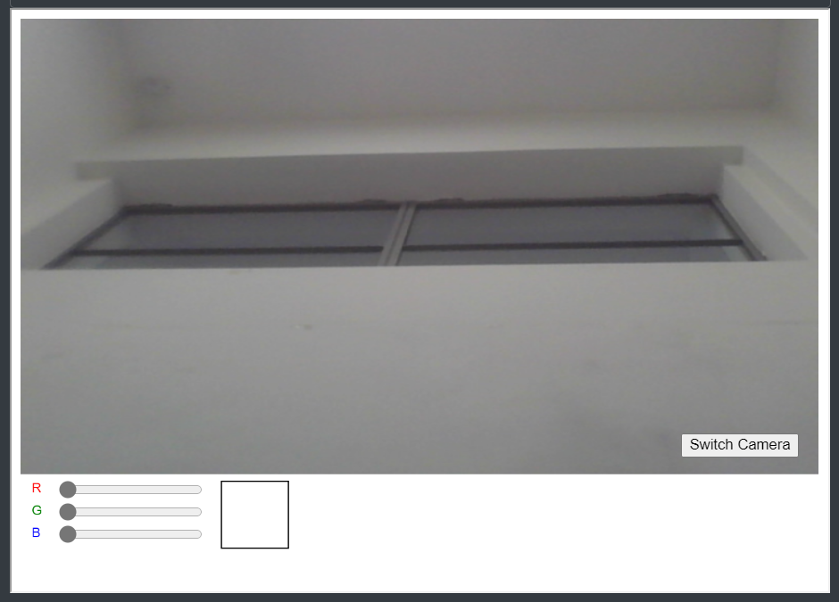

# Results

`p5` helps add [p5 sketches](https://p5js.org/) into your book. There are two types of `p5` [shortcodes](https://gohugo.io/content-management/shortcodes/) according to the html element used to embed them.

## Codes

### [Re Coloring](./ReColoring)
Brief description of the sketch.

### [Palette Generator](./PaletteGenerator)
Brief description of the sketch.

### [Color Tracker](./ColorTracker)
Brief description of the sketch.

