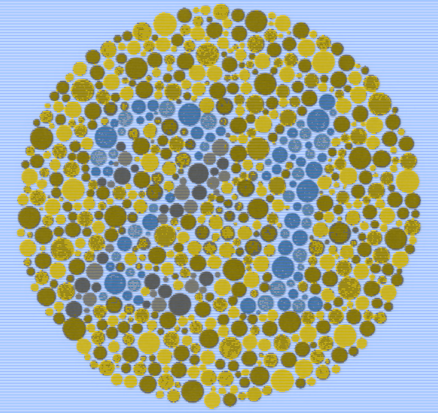
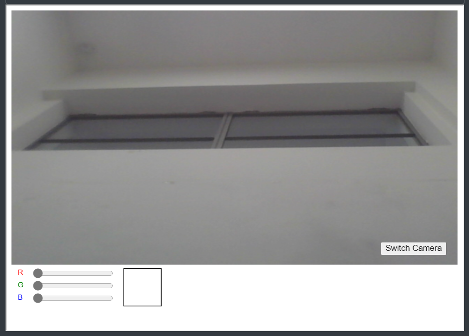

# Results

`p5` helps add [p5 sketches](https://p5js.org/) into your book. There are two types of `p5` [shortcodes](https://gohugo.io/content-management/shortcodes/) according to the html element used to embed them.

## Codes




## [Re Coloring](./ReColoring)
Este código es una aplicación que cambia la paleta de colores de una imagen y muestra la imagen transformada.
El usuario puede elegir entre seis paletas de colores diferentes para transformar la imagen.




## [Palette Generator](./PaletteGenerator)
Este script es una implementación en p5.js de un algoritmo que extrae los colores predominantes de una imagen 
y muestra una paleta de colores correspondiente en la parte inferior de la imagen.




## [Color Tracker](./ColorTracker)
El código es una aplicación web que utiliza la cámara del dispositivo para capturar video y detectar colores 
en tiempo real. Permite al usuario ajustar los valores de color para buscar un tono específico y muestra 
información sobre el nombre, código hexadecimal y tono del color seleccionado.





